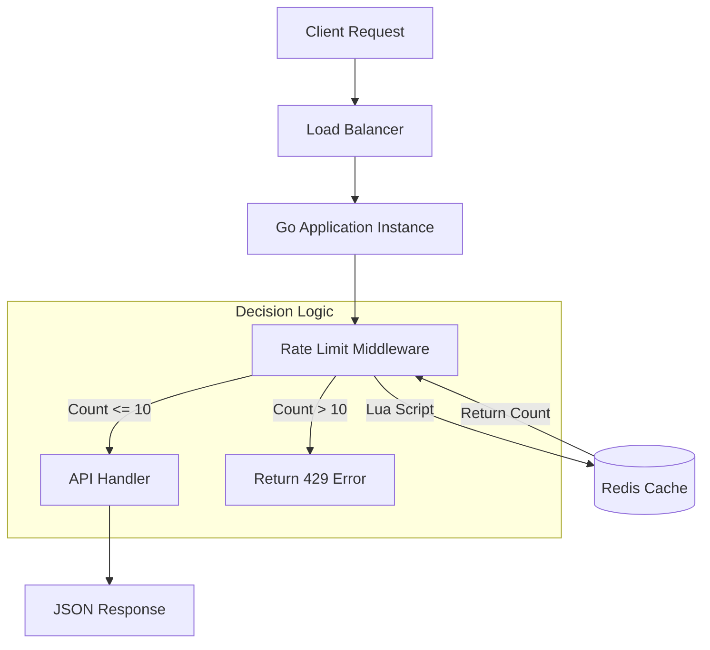

# Distributed API Rate Limiter

A high-concurrency, distributed rate-limiting middleware service built with Go (Golang) and Redis. Designed to throttle traffic based on client IP addresses, protecting backend resources from abuse and DDoS attacks. This system ensures thread safety and data consistency across distributed instances using atomic Lua scripts.

## System Architecture

The system uses a middleware pattern to intercept HTTP requests before they reach the business logic. State is maintained centrally in Redis to allow multiple application replicas to share the same rate limits.

### Request Flow

1. **Interceptor**: The middleware extracts the client's IP address from the request header.
2. **Atomic Check**: A custom Lua script is executed against the Redis cluster.
   - **Step A**: Increments the counter for the specific IP.
   - **Step B**: Sets a Time-To-Live (TTL) expiry if the key is new.
   - **Step C**: Returns the current count.
3. **Decision**:
   - If `count <= limit`: Request is forwarded to the controller.
   - If `count > limit`: Request is rejected immediately with HTTP 429.

### System Design Diagram



## Data Schema (Redis)

Since Redis is a NoSQL key-value store, this project uses a specific key naming strategy to isolate users and enforce time windows.

**Algorithm**: Fixed Window Counter

| Key Format | Value Type | Value Description | TTL (Time to Live) |
|------------|------------|-------------------|-------------------|
| `rate_limit:{user_ip}` | Integer | Current request count | Resets every window (e.g., 60s) |

**Example Data State**:
```
Key: "rate_limit:192.168.1.50"
Value: 4
TTL: 55 seconds remaining
```

## Technology Stack

- **Language**: Go (Golang) 1.22+
- **Framework**: Echo v4 (High-performance web framework)
- **Database**: Redis v7+ (In-memory data store)
- **Containerization**: Docker & Docker Compose
- **Deployment**: Railway / Cloud Ready

## Installation & Setup

### Prerequisites

- Go 1.22 or higher
- Docker & Docker Compose
- Redis (if running locally without Docker)

### Option 1: Run via Docker (Recommended)

This sets up both the Application and the Redis database in isolated containers.

1. **Clone the repository**
```bash
git clone https://github.com/yourusername/rate-limiter.git
cd rate-limiter
```

2. **Start the services**
```bash
docker-compose up --build
```

3. **Verify**

The API will be available at `http://localhost:8000`.

### Option 2: Run Locally

1. **Start Redis**

Ensure a Redis instance is running on port 6379.

```bash
docker run -p 6379:6379 redis:alpine
```

2. **Install Dependencies**
```bash
go mod download
```

3. **Run the Application**
```bash
go run main.go
```

## Configuration

The application is configured via environment variables. Create a `.env` file in the root directory.

| Variable | Default | Description |
|----------|---------|-------------|
| `PORT` | `8000` | Port for the HTTP server |
| `REDIS_ADDRESS` | `localhost:6379` | Redis Host:Port OR full redis:// connection string |
| `REDIS_PASSWORD` | Empty | Password for Redis authentication |
| `REDIS_DB` | `0` | Redis Database Index |

## API Usage

### Health Check Endpoint

**Request**:
```bash
curl -i http://localhost:8000/v1/health
```

**Response (Allowed)**:
```http
HTTP/1.1 200 OK
X-RateLimit-Limit: 10
X-RateLimit-Remaining: 9
X-RateLimit-Reset: 16789000

{"message": "The service is running correctly"}
```

**Response (Blocked)**:
```http
HTTP/1.1 429 Too Many Requests
Content-Type: application/json

{"error": "Rate limit exceeded."}
```

## Technical Highlights

- **Concurrency Safe**: Utilizes Redis Lua scripting to prevent race conditions during the "Read-then-Increment" phase, ensuring 100% accurate counting even under high parallel load.
- **Dependency Injection**: Implements a clean architecture pattern where services and repositories are injected, making the codebase testable and modular.
- **Low Latency**: Designed to add less than 10ms overhead to requests by utilizing efficient Redis pipelining/scripting.

## Project Structure

```
rate-limit/
├── config/          # Configuration management
├── domain/          # Business logic interfaces
├── handler/         # HTTP request handlers
├── middleware/      # Rate limiting middleware
├── model/           # Data models
├── routes/          # Route definitions
├── service/         # Business logic implementation
├── docker-compose.yml
├── Dockerfile
└── main.go
```

## License

MIT License - feel free to use this project for learning or production purposes.